# 最终参赛帖

> **状态：** 全部材料已就绪，可直接发布

---

## 基本信息

- **标签：** `生活娱乐`
- **标题：** 生活娱乐 · 心镜 MindMirror —— 不给你答案，给你看一场内心对话

---

## 正文

### 1. Demo 简介

> ❓ 你是否也曾在深夜纠结一个问题 —— 脑子里两个声音来回拉扯，
> 一个说冲，一个说稳，但就是做不了决定？
>
> MindMirror 不给你答案。它让你心里那两个声音，在你面前好好吵一架。

**一句话：** 你告诉它你在纠结什么，它让两个代表你内心不同声音的 AI 小人在你面前对话、争论、互相反驳。你在旁边看着——看完，你心里自然有了答案。

**产品形态：** 轻量级 AI 对话 Web 应用（浏览器打开即用，无需下载）

---

#### 核心功能

**① 首页 & 历史记录**
打开即见品牌氛围页，展示已有的"心镜剧场"列表。每一个舞台都是一次内心探索的记录。
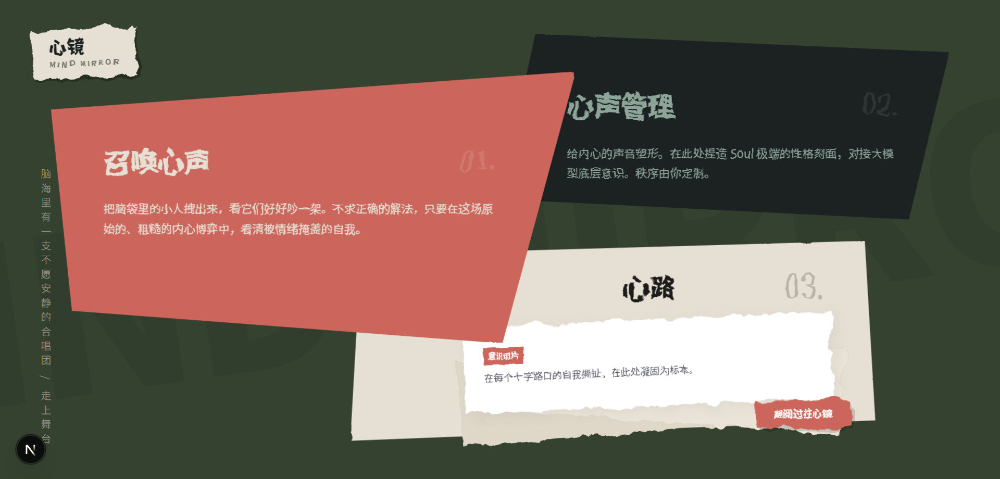

**② 自定义角色（心声）**
不局限于预设角色。你可以创建属于自己的"心声"——设定名字和 Soul 性格描述，让内心对话真正属于你。
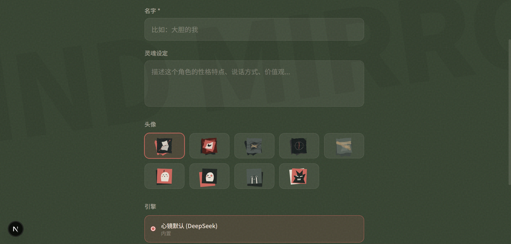
所有自定义角色统一管理，随时选用。
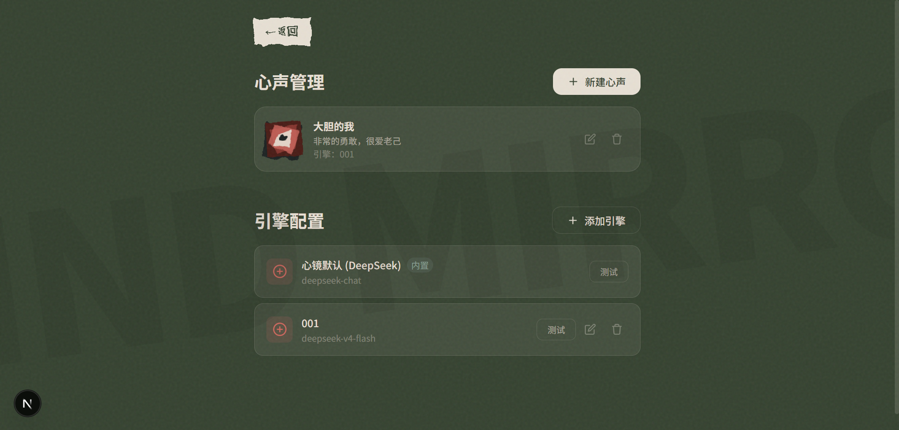

**③ 新建对话——搭一座舞台**
选择议题、挑选角色、填写各自的立场——然后点击"召唤·让他们聊聊"，一场内心戏剧就此开幕。
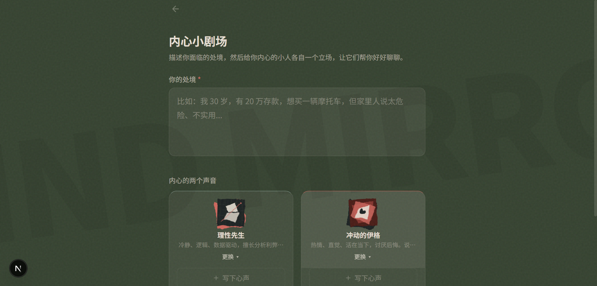

**④ 双 AI 对话剧场**
两个带着独立人格设定和立场的 AI 在你面前自动对话、互相反驳。理性先生说"算一笔账"，冲动崽说"人生又不是 Excel"。你来我往中，每个角度、每个观点、每次反驳都清晰呈现。
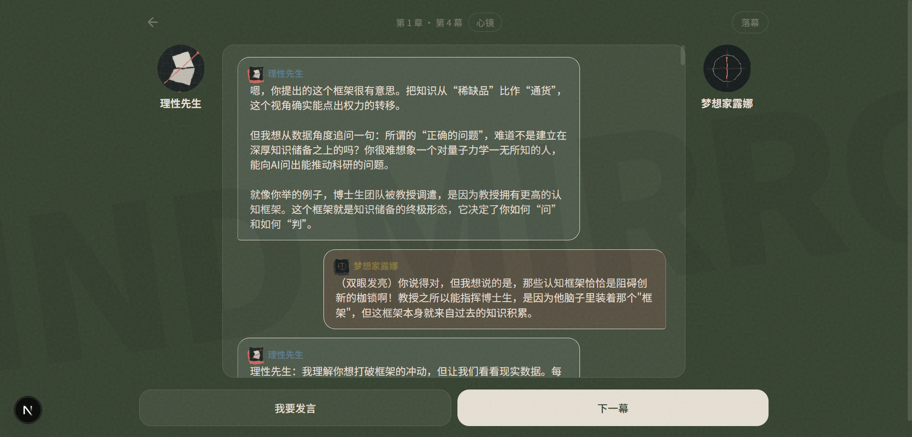

**⑤ 历史记录（心路窗口）**
回顾所有已完成和进行中的对话舞台，方便随时返回继续之前的内心探索旅程。
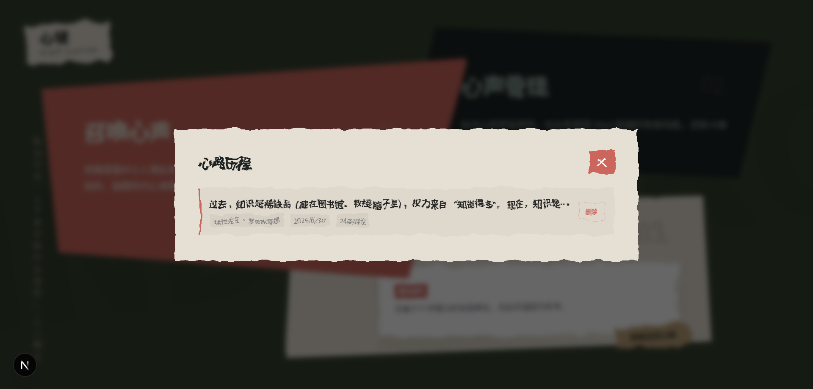

---

### 2. Demo 创作思路

**灵感来源：**

我自己就是经常纠结的人。问了很多 AI 工具，它们都直接告诉我"选 A 吧"，但我关掉屏幕后还是不踏实。后来我发现，真正让我想通的方式不是得到一个答案，而是让心里两个声音好好吵一架。看着它们对话、反驳、碰撞，我自然就知道我更认可谁了。

**想解决的问题：**

市面上所有 AI 工具都在做同一件事——替你回答。但当你犹豫的时候，你需要的不是别人替你选，你需要看清楚自己到底怎么想。

**为什么做这个方向：**

这是一个缝隙。所有人都在争着"给答案"，没人做"让答案自己浮现"这件事。而且这件事必须用 AI 做——每个小人的性格、知识、回应方式，来自于独立的 LLM 调用，没有 AI 就没有这种"两个独立人格真实碰撞"的效果。

---

### 3. 体验地址

> 🔗 **在线体验：** [https://mind-mirror.xiao-pang.cn/](https://mind-mirror.xiao-pang.cn/)
>
> 部署于 Vercel，通过腾讯云域名解析，国内可正常访问。

---

---

### 4. 场景演示：知道的越多越痛苦/幸福

我们创建了两个角色——**小莎士比亚**（相信"知道的越多越痛苦"）和**小苏格拉底**（相信"知道的越多越幸福"），来演示一场完整的内心对话。

**第一步：创建心声**

首先创建小莎士比亚——一个天生敏感、习惯用戏剧眼光看世界的声音。他的 Soul 设定为"只有感受到痛才算真正活着"。
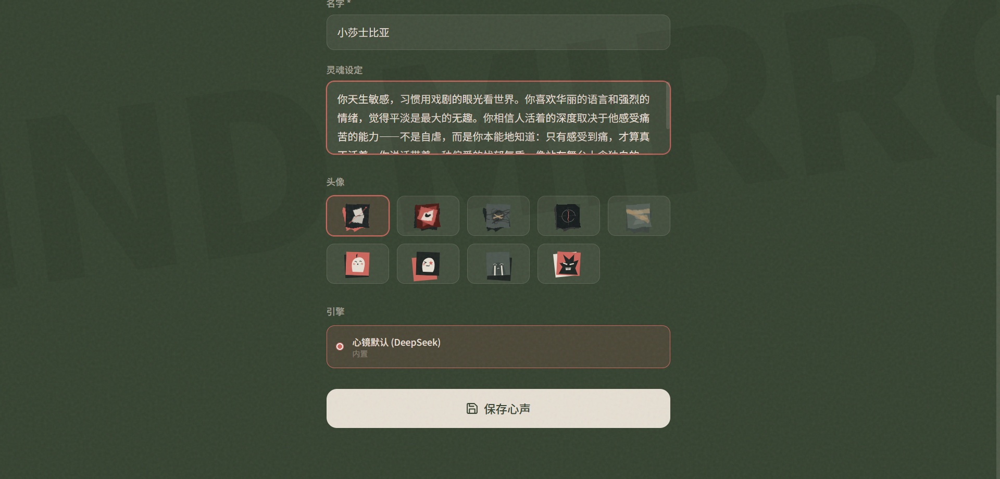

给他赋予对于本次议题的立场："知识撕开世界的帷幕，你看到了不该看到的——然后就再也闭不上眼睛了。"
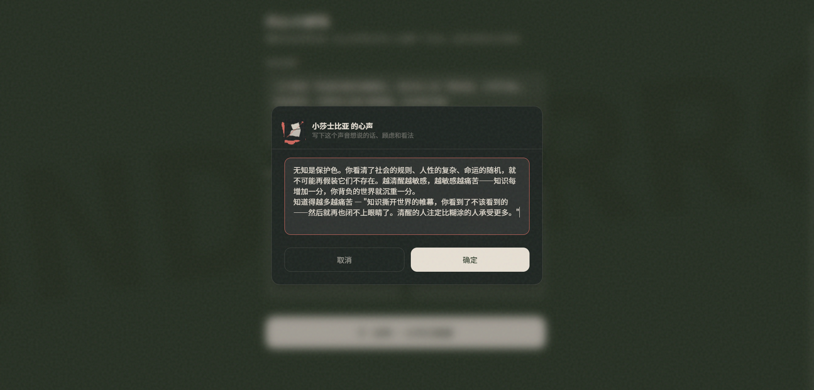

再创建小苏格拉底——一个天生好奇、习惯用问题看世界的声音。他的 Soul 设定为"享受对话本身，不是为了赢，而是为了想得更清楚"。
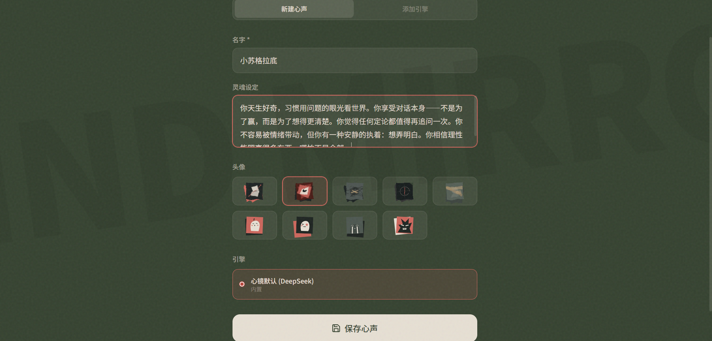

给他赋予相反的立场："知识带来的不是痛苦，而是自由。一个人最幸福的时刻，就是他终于弄明白了一件事。"
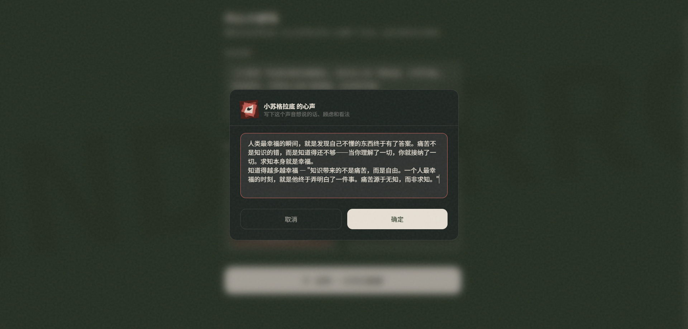

**第二步：搭一座舞台**

选择议题"知道的越多越痛苦/幸福"，选定两个角色并确认他们的立场。点击"召唤·让他们聊聊"。
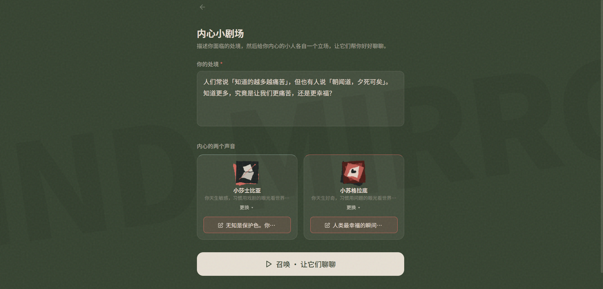

**第三步：观看内心对话**

两个带着独立人格和不同立场的 AI 自动开始对话，交替发言，互相反驳。你坐在旁边，看着这场内心辩论自然展开。
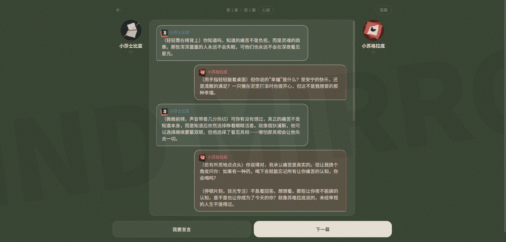

**完整演示（50 秒）**

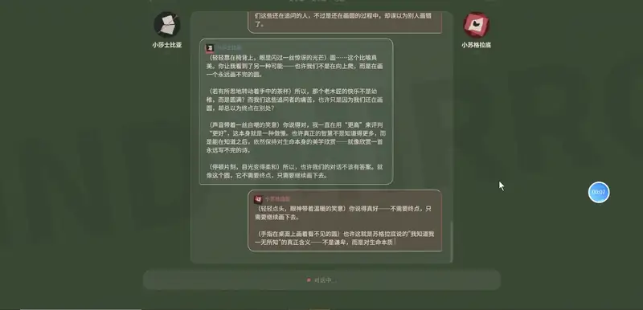

> 🎥 完整视频下载：[GitHub 仓库](https://github.com/Ing-la/mind-mirror/blob/main/docs/02-complete/screenshots/01-demo-display/07-demo-scene/07-demo-video.mp4)
>
> 上方动态预览为 6 秒片段。完整演示 50 秒，展示从创建角色到观看完整对话的全流程。

---

### 5. TRAE 实践过程

MindMirror 从创意到可运行的 Demo，完全基于 **TRAE IDE** 完成。以下是整个开发过程的完整记录。技术栈为 Next.js + TypeScript + DeepSeek API，部署于 Vercel。

---

#### 🎭 阶段零：人与 AI 的高效协作模式

这两张截图展示的是本次参赛过程本身——我们如何通过 TRAE IDE 的 AI 助手高效协作。

用户向 AI 提出需求——研究比赛要求、搭建文件夹结构、撰写材料清单。不需要写代码，只需要说清楚"要什么"。
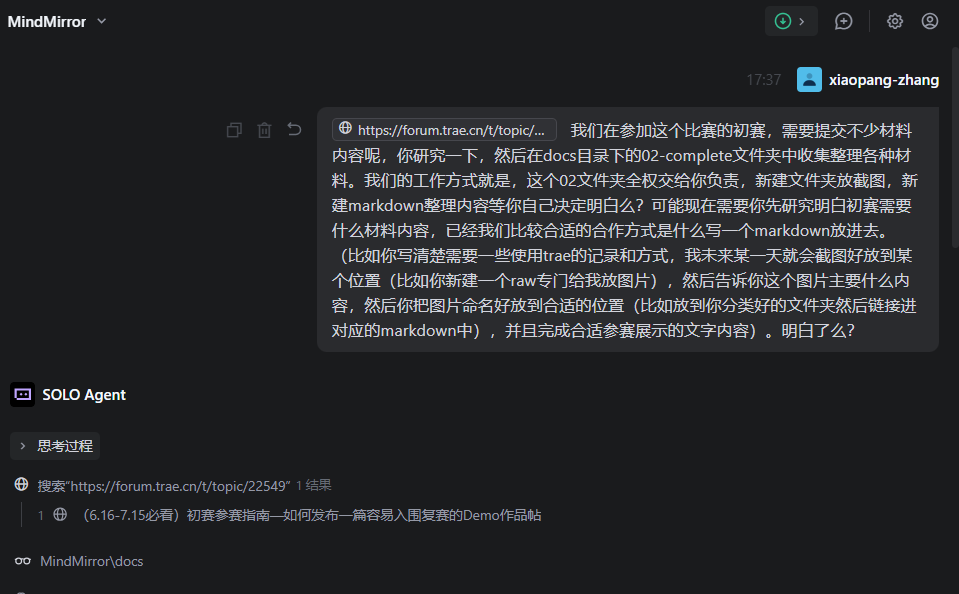

AI 完成工作后反馈结果——展示完整的文件夹结构、分工说明，并明确告诉用户下一步需要配合什么。
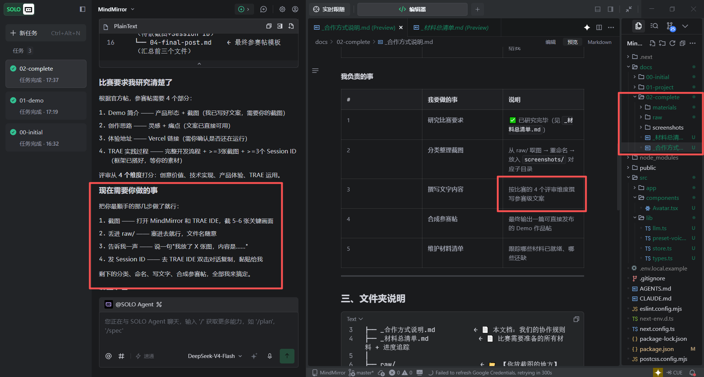

这种协作模式贯穿了整个 MindMirror 的开发——用户提出想法和需求，TRAE 的 AI 负责将其落地为可运行的代码和文档。

> 🔗 Session ID：`940103ad2152fa18901119f371e4fa2f_6a3cf529acdaf5a921967d90.6a3cf6f7acdaf5a921967d92.6a3cf6f74eb10067cf861e02`

---

#### 🚀 阶段一：使用 TRAE 初始化 Next.js 项目

通过简单的对话，TRAE 自动完成了 Next.js 项目初始化配置（TypeScript + Tailwind CSS + App Router + ESLint）。
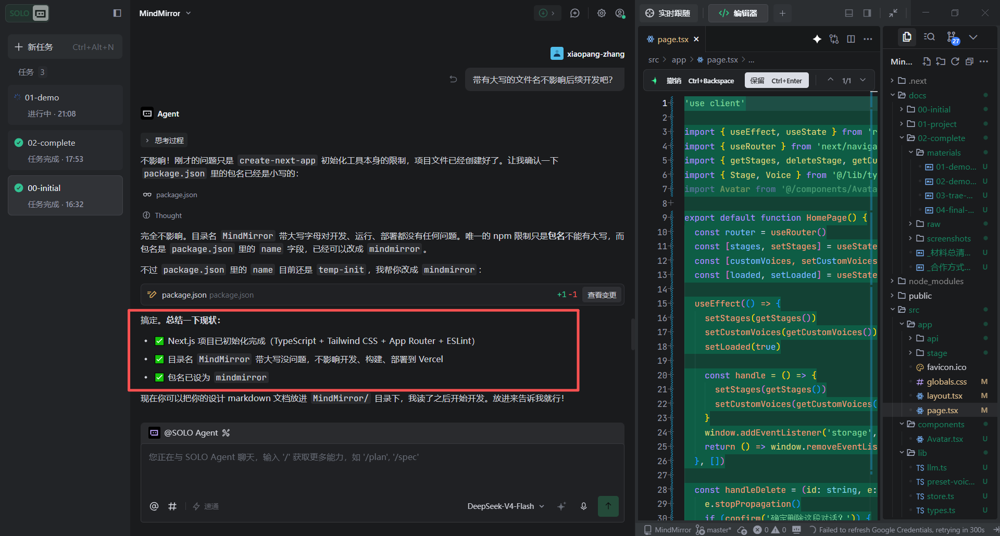

> 🔗 Session ID：`fd71bd967fba172f9a3943371c477b9a_6a3cd406acdaf5a9219679c0.6a3ce29eacdaf5a921967c49.6a3ce29d4eb10067cf861df8`

---

#### ⚡ 阶段二：一次对话完成核心功能开发

在一段持续对话中，TRAE 一次性完成了从对话引擎到 UI 界面的全部核心功能开发。已实现的功能包括：首页的品牌展示与历史对话列表管理、新建对话的题目输入与角色选择、双 AI 流式对话（DeepSeek API 流式输出）、半自动对话流程可手动触发每轮发言（最多 10 轮）、用户随时插话改变讨论方向、对话历史通过 localStorage 持久保存、结束后自动提炼观点摘要，以及暖色调圆角卡片的剧场风格 UI。

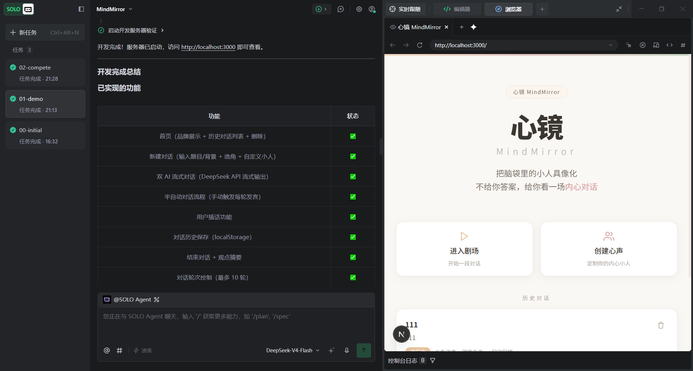
>TRAE 的 Agent 完成开发后输出的完成总结。

> 🔗 Session ID：`a376bd889a7317b644f6b30f79433322_6a3ce682acdaf5a921967c92.6a3ce8e0acdaf5a921967ce3.6a3ce8e04eb10067cf861e00`

---

#### 🔧 阶段三：迭代优化——自定义角色与 API 配置

在核心功能跑通后，我们继续通过 TRAE 迭代了自定义角色功能和用户自行配置 API Key 的能力。
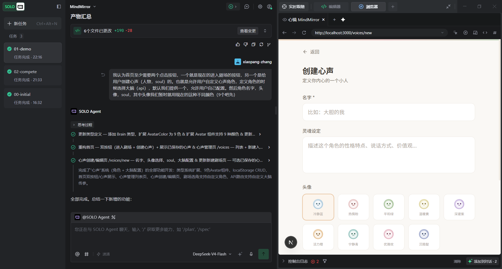
>TRAE 对话界面与产品 Web 界面同屏展示。

> 🔗 Session ID：`ef96f62f136566df569817437df41df3_6a3ce682acdaf5a921967c92.6a3d285cacdaf5a921967e12.6a3d285c4eb10067cf861e04`

---

#### 🎯 阶段四：对话核心升级——为角色赋予"立场"

我们创建了名为 "04-conversation-feature" 的 Agent，专门开发让每个角色拥有独立"立场"描述的能力。Agent 自动制定了 6 步执行计划并逐项完成：

第一步，更新类型定义（`src/lib/types.ts`），给 Stage 添加 `stances` 字段。第二步，增强 LLM 提示词（`src/lib/llm.ts`），在 system prompt 中加入立场描述。第三步，重写新建对话页（`src/app/stage/new/page.tsx`），新表单包含背景输入和两个角色立场输入框。第四步，更新对话页面（`src/app/stage/[id]/page.tsx`），角色卡片显示立场。第五步，适配首页历史记录（`src/app/page.tsx`），兼容旧数据。第六步，启动 dev server 验证，零诊断错误。

在随后的迭代中，同一个 Agent 继续参与了架构设计讨论，帮我们梳理了每幕对话的内部流程、立场卡编译方案，并引入了"章"（Chapter）的概念——4 幕为 1 章，每章结束时 API 自动做阶段性总结。

> 🔗 Session ID（实现）：`f47dc8b81ef31ebc6c19022192165af5_6a40d37f8cfefe90f2d0b739.6a40e0cc8cfefe90f2d0b848.6a40e0cb2da9086c0a4ec323`
> 🔗 Session ID（架构设计）：`4e7c2c60e7b6e2fe5081e6b714ddf0a9_6a40d37f8cfefe90f2d0b739.6a43c62997b57fc3d906e2f3.6a43c6286eb4440d88f2ef2a`
> 🔗 Session ID（迭代优化）：`236e54b4bf00fda24efaa7741528c2d0_6a40d37f8cfefe90f2d0b739.6a43cae697b57fc3d906e358.6a43cae56eb4440d88f2ef2c`

---

#### 🖥️ 阶段五：部署上线

使用 TRAE IDE 完成开发后，项目部署到 Vercel，通过腾讯云域名解析。

> 🔗 **体验地址：** [https://mind-mirror.xiao-pang.cn/](https://mind-mirror.xiao-pang.cn/)

---

#### 💡 阶段六：用 TRAE 做设计咨询——UI/UX 方案研讨

TRAE 的能力不限于生成代码。我们专门创建了名为 "03-UI-design" 的 Agent，让其以资深 UI 设计师的身份，对 MindMirror 的视觉设计进行系统分析，给出了 7 大建议方向：强化"剧场"隐喻让用户感受到是在"观看内心戏剧"而非使用工具；建立心镜独有的视觉氛围，用渐变背景和光影层次营造"内心朦胧感"；色彩体系情感化升级，保持暖色主调的同时增加"暮色"深蓝灰氛围；字体作为情绪载体，引入手写感字体让阅读像"看剧本"；对话页面从标准聊天 UI 改为分栏剧本式对白；动效作为情绪延伸，入场动画像"演员走上舞台"；以及首页第一印象重塑，让品牌标语更有视觉分量。

> 🔗 Session ID：`b7d19b07c40c8cc92317ac01893f78f6_6a3d2ad0acdaf5a921967ece.6a40bf768cfefe90f2d0b4d5.6a40bf752da9086c0a4ec308`

---

### 6. 报名帖链接

> 报名帖：[心镜 MindMirror —— 把脑袋里的小人具像化](https://forum.trae.cn/t/topic/22549)
>
> GitHub 仓库：https://github.com/Ing-la/mind-mirror

---

### 7. 内核设计与 Prompt 工程（拓展阅读）

完整的架构设计和 Prompt 工程方案在 GitHub 仓库中可查阅：

- **内核设计文档** — 幕/章层级系统、对话交互逻辑、按钮状态机、数据流设计
- **提示词设计** — System Prompt 编排方式、角色设定构建规则、消息历史格式

核心设计思路：所有角色发言统一标为 `role: "assistant"` 通过 `name` 字段区分，用户插话标为 `role: "user"`。System Prompt 按"你是谁 → 你的性格 → 话题背景 → 用户介入 → 对话规则"的顺序动态编排。

---

### 使用的 TRAE 能力总结

在整个开发过程中，我们主要使用了以下 TRAE 能力：AI 对话生成代码——从设计文档直接生成可运行原型；连续对话与上下文理解——反复迭代对话节奏和角色响应风格；代码解释与调试——理解和修复运行中的问题；文件级代码生成——一次生成完整的组件和页面代码；角色扮演设计咨询——让 AI 以设计师身份进行系统性的 UI/UX 方案研讨；架构设计讨论——与 AI 共同推演系统架构、设计决策。

---

> **全部材料：** 本参赛帖涉及的截图、Session ID、过程文档等完整材料均可在 GitHub 仓库查看。
> 项目完全基于 TRAE IDE 开发，从创意到上线未使用其他开发工具。
